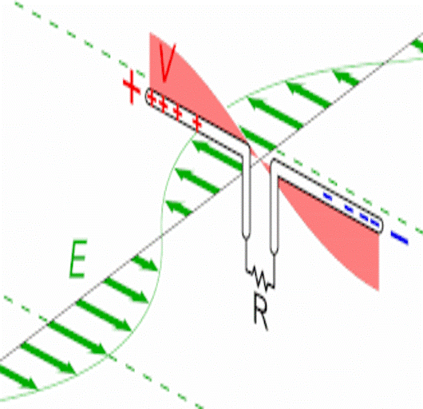
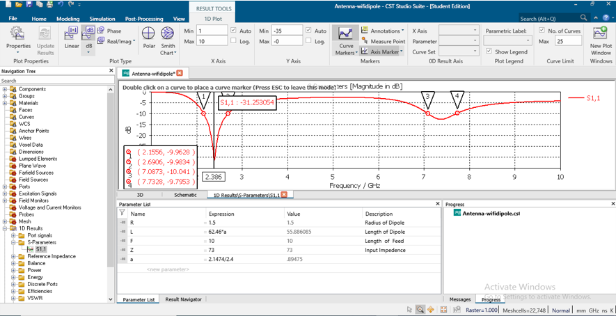
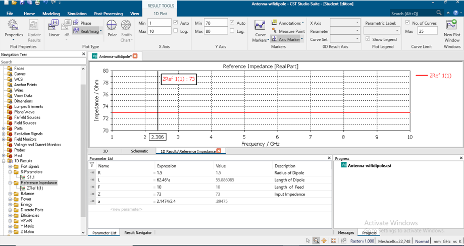
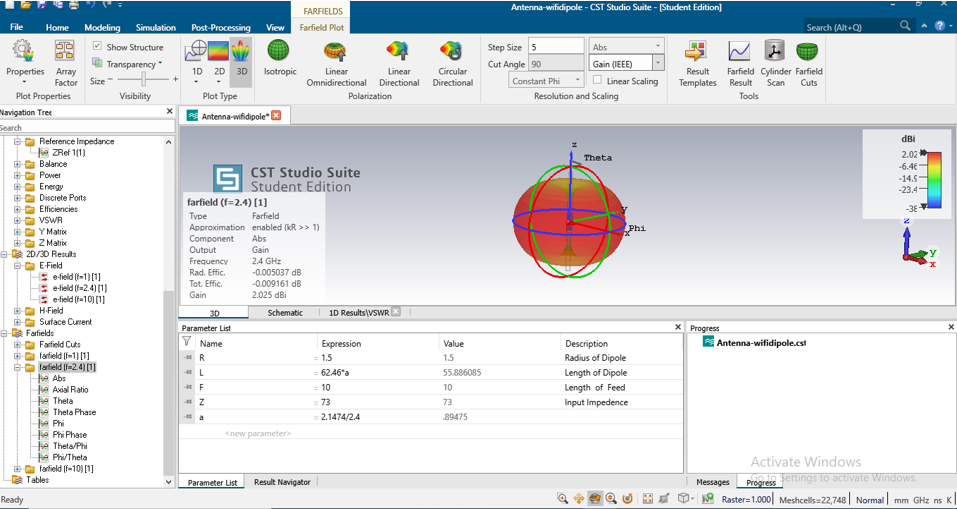
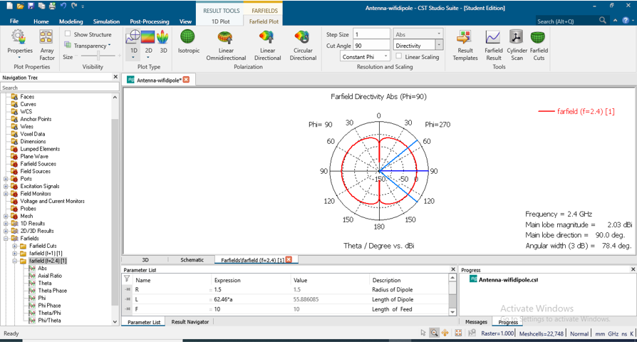
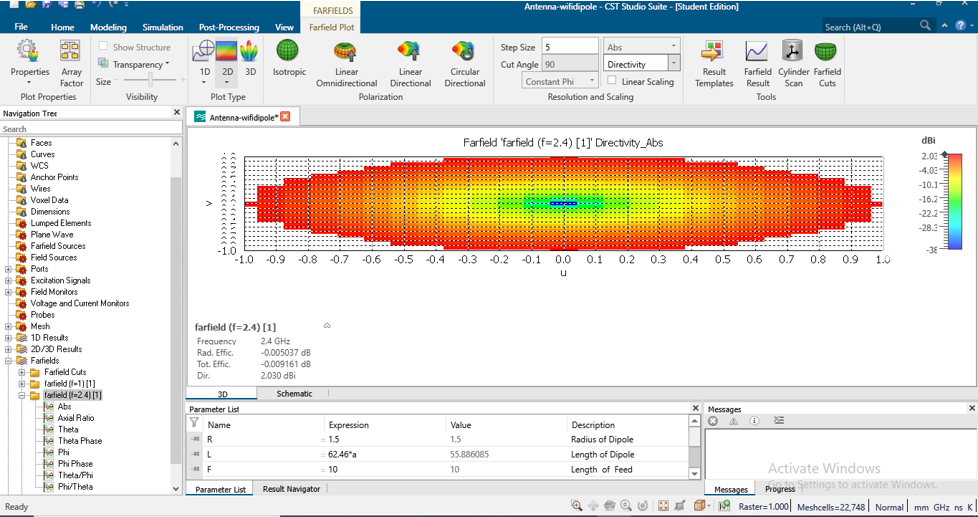

<div align="center">  
<h1 align="center">  
   
<br>Dual-Band-Dipole-Antenna</h1>  
</div> 

## ✨ Design Optimization  
Optimization of the antenna design is performed to ensure that the antenna operates efficiently at the desired frequencies, achieving good performance for the required parameters.  

---

## 📊 Output Considerations  

- **S-Parameter**: 📉 Shows the reflection coefficient and bandwidth of the antenna.  
- **Reference Impedance**: 🎯 The input impedance of the antenna.  
- **VSWR**: 📏 Voltage Standing Wave Ratio for impedance matching.  
- **Gain**: 📡 The gain of the antenna in dBi.  
- **Directivity**: 🔭 Directivity of the antenna, showing the focused energy direction.  
- **Radiation Patterns**: 🌀 Both 1-D and 2-D radiation patterns are analyzed to understand the antenna's radiation behavior.  

---

### S-Parameter  
The S-parameter of the antenna is shown in the following figure, which indicates the reflection coefficient at the operating frequencies.  

  

---

### 📐 Bandwidth Calculation  
From the S-parameter, the bandwidth of the antenna is calculated:  
- **BW1** = 0.535 GHz (2.6906 - 2.1556)  
- **BW2** = 0.645 GHz (7.7328 - 7.0873)  

---

### 🔌 Reference Impedance  
The input impedance of the dual band dipole antenna is shown below.  

  

---

### VSWR 📶  
The Voltage Standing Wave Ratio (VSWR) is an important parameter for impedance matching.  

.png)  

---

### 🚀 Gain  
The gain of the dual band dipole antenna is calculated as **2.025 dBi**.  

  

---

### Directivity 🔦  
The directivity of the antenna shows how the antenna radiates energy in different directions.  

  

---

### 🌐 Radiation Patterns  
The radiation patterns in both 1-D and 2-D are shown below.  

#### 1-D Radiation Pattern 📈  
  

#### 2-D Radiation Pattern 📊  
  

---

## 🎯 Design Accuracy  

The directivity of the dipole antenna achieved by simulation is **2.030 dBi**, which is very close to the calculated value, indicating good design accuracy.  

---

## 🎉 Finally  

- A **Dual Band Dipole Antenna** was successfully designed and simulated.  
- All output parameters, including S-parameters, gain, directivity, and radiation patterns, were obtained with maximum accuracy.  

---

## 🗂️ Folder Structure  

```
Antenna-wifidipole/
├── DC
├── Model
│   ├── 3D
│   ├── ASM
│   ├── CBLS
│   │   └── Harness
│   ├── DS
│   │   ├── Block
│   │   └── Images
│   └── PCBS
│       └── Design
├── ModelCache
├── Result
│   ├── Cache
│   ├── DS
│   │   └── Block
│   ├── Meshfill
│   └── MS
├── SP
├── Temp
├── images
├── presentation
└── source file
```  

- **📂 Antenna-wifidipole**: Contains the main project files, including model, results, and design files.  
- **🖼️ images**: Contains images related to the project (S-parameters, radiation patterns, etc.).  
- **📑 presentation**: Contains the presentation files for the project.  
- **💻 source file**: Contains the source code and configuration files.  

---

## ⚙️ Installation  

To run this project, you need **CST Studio** for antenna simulation. Follow the steps below:  
1. Open CST Studio.  
2. Load the **Model** files from the `Antenna-wifidipole` folder.  
3. Run the simulation and analyze the results.  

---

## 📜 License  

This project is licensed under the MIT License. See the LICENSE file for more information. 🌟  
